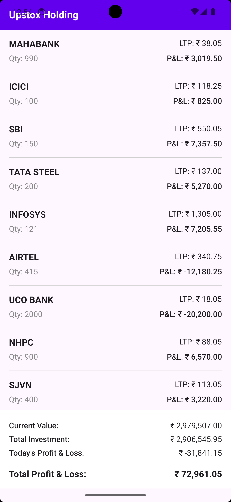

# Upstox Interview Project



## App Description
This is a modern Android application designed to provide users with a real-time overview of their investment holdings. By integrating with a remote API, the app fetches user holding data and provides a comprehensive breakdown of portfolio performance, including total current value, total investment, and profit/loss metrics.

## Task Description
The goal of this project is to create a simple Android application that fetches and displays user holdings from a remote API. The application calculates and displays various portfolio metrics based on the data received.

### Key Calculations:
1.  **Current Value**: Total market value of all holdings (Sum of `LTP * Quantity`).
2.  **Total Investment**: Total cost of acquiring the holdings (Sum of `Average Price * Quantity`).
3.  **Total PNL**: Overall profit or loss (`Current Value - Total Investment`).
4.  **Today's PNL**: Daily profit or loss based on the close price (Sum of `(Close - LTP) * Quantity`).

## Features Achieved
- **Network Layer**: Integrated Retrofit with Gson converter to fetch data from a REST API.
- **Data Modeling**: Created structured data models to parse the API response.
- **MVVM Architecture**: Implemented a clean separation of concerns using the Model-View-ViewModel pattern.
- **State Management**: Used Kotlin Flows and `StateFlow` to manage UI states (Loading, Success, Error).
- **Jetpack Compose UI**: Built a modern, reactive UI using Jetpack Compose, featuring:
    - A scrollable list of holdings (`LazyColumn`).
    - A bottom summary section for portfolio metrics.
    - Lifecycle-aware state collection.
- **Modular Codebase**: Organized code into dedicated packages for better maintainability:
    - `model`: Data structures.
    - `network`: Retrofit client and API service.
    - `repository`: Data handling logic.
    - `viewmodel`: UI logic and state management.
    - `screens`: Composable UI components.
    - `utils`: Helper functions.
- **Resource Management**: Extracted hardcoded strings into `strings.xml`.

## Project Structure
```text
com.upstox.interview
├── model/                # Data models for API response
├── network/              # Retrofit configuration and ApiService
├── repository/           # Repository pattern implementation
├── screens/              # Jetpack Compose UI screens
│   └── userholdings/     # User Holdings specific UI components
├── viewmodel/            # ViewModels and ViewModelFactory
└── utils/                # Utility classes (e.g., CurrencyFormatter)
```

## Architecture: MVVM
- **Model**: Represents the data from the API (`UserHolding`, `HoldingsResponse`).
- **View**: Jetpack Compose functions that display the data and observe the ViewModel's state.
- **ViewModel**: Acts as a bridge, fetching data from the Repository and exposing it as a `StateFlow` for the View to observe.
- **Repository**: Handles data operations, abstracting the source (API) from the ViewModel.
